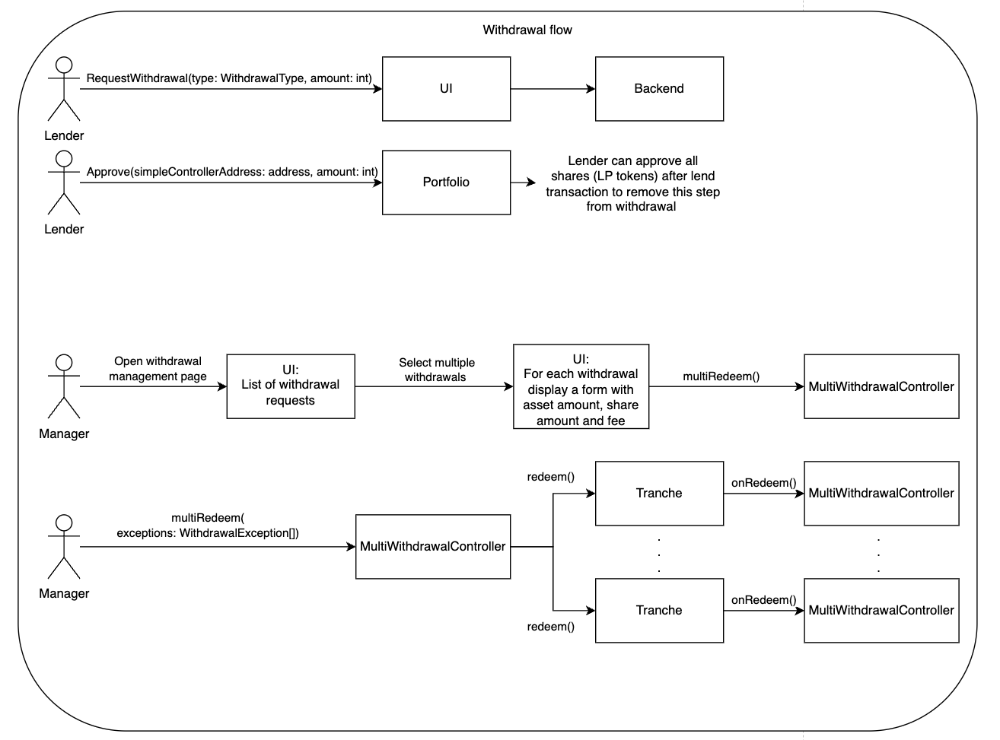

# 🦀 Multi-withdrawal controller

## Overview
The multi-withdrawal controller is designed to give the portfolio manager finer control over withdrawals processed within the portfolio term.
It allows the manager to set withdrawal exceptions (negotiated off-chain) for investors and process withdrawals based on these exceptions.

This controller offers two modes of processing redemptions/withdrawals.
The modes are mutually exclusive, and which one can be used at a given time is dependent on whether withdrawals are allowed in the current stage of portfolio lifecycle (capital formation/open/closed).

- If withdrawals are allowed in the current stage, investors may withdraw their funds by themselves on regular terms (no fee, share price calculated based on the amount of shares and portfolio liquidity).
- If withdrawals are not allowed, only the manager can perform withdrawals for them using the `multiRedeem` function.

By default, every tranche disallows withdrawals while the portfolio is active or accumulating capital, and allows them after the portfolio term has ended.

## Withdrawal exception
```solidity
struct WithdrawalException {
    address lender;
    uint256 shareAmount;
    uint256 sharePrice;
    uint256 fee;
}
```
The withdrawal exception model contains the lender address, the amount of shares they will redeem, a share price relative to asset (for the purpose of this withdrawal) and a withdrawal fee percentage.
The share price and fee are expressed in basis points (10000 BPs = 100%).

## Methods

### Used by the Portfolio Manager
```solidity
function setWithdrawAllowed(bool newWithdrawAllowed, Status portfolioStatus) public
```
Used to allow withdrawals by investors for a particular stage of portfolio lifecycle (capital formation/open/closed).
Portfolio stage/status is represented by the `Status` enum from Structured Portfolio:
```solidity
enum Status {
    CapitalFormation,
    Live,
    Closed
}
```

```solidity
function multiRedeem(address vault, WithdrawalException[] memory exceptions) external
```
Used to action withdrawals based on exceptions for one or more investors.
In order for it to work, the investors must first allow the controller contract to use their portfolio shares token.

```solidity
function setFloor(uint256 newFloor) public
```
Sets the tranche floor.
Any withdrawals that would result in portfolio liquid value dropping below this amount before the portfolio term ends will be reverted.
This is respected both by regular and by exception withdrawals.

```solidity
function configure(uint256 newFloor, WithdrawAllowed memory newWithdrawAllowed) external
```
Configures the portfolio floor and allows/disallows withdrawals for one particular stage of portfolio lifecycle.
It accepts the `WithdrawAllowed` structure below.
```solidity
struct WithdrawAllowed {
    Status status;
    bool value;
}
```

### View functions

```solidity
function maxRedeem(address owner) external view returns (uint256)
```
Returns the maximum amount of asset tokens that the `owner` can withdraw, factoring in the available liquidity and portfolio floor.

```solidity
function maxWithdraw(address owner) public view returns (uint256)
```
Returns the maximum amount of shares tokens that the `owner` can redeem, factoring in the available liquidity and portfolio floor.

## Diagrams

